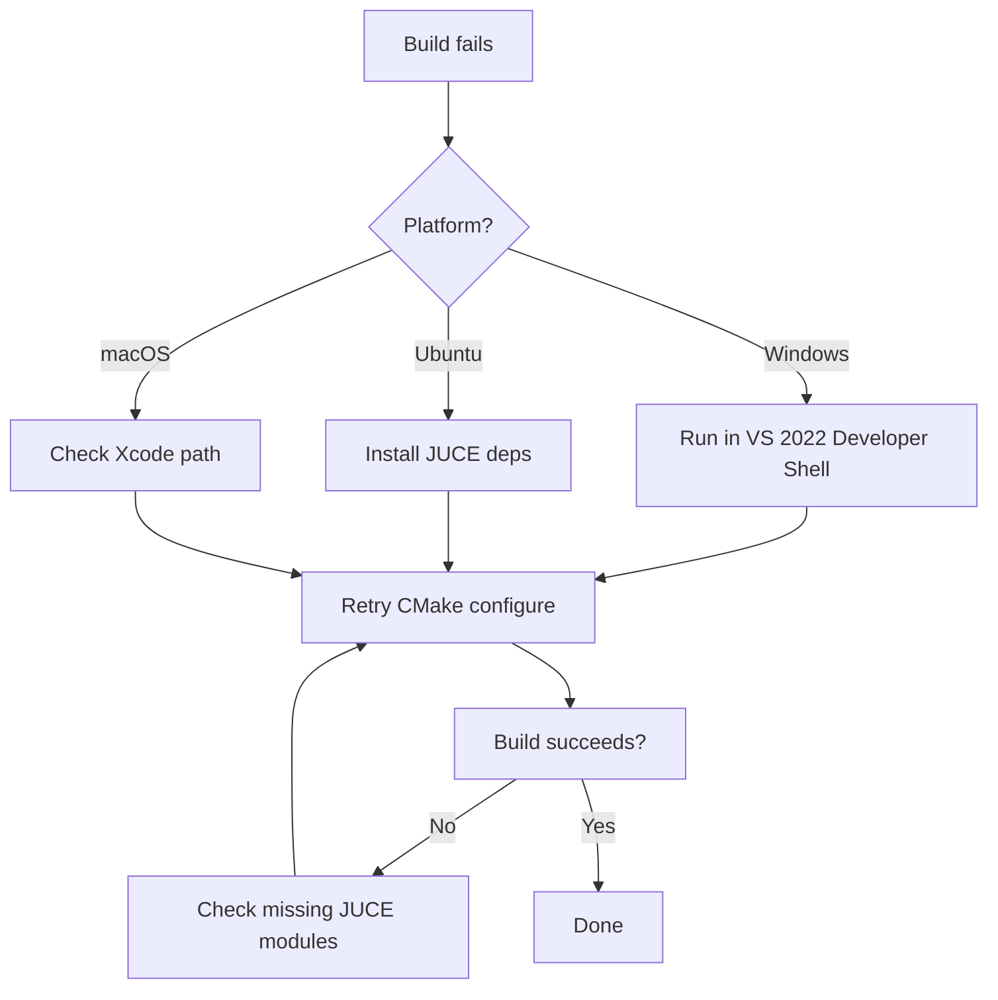

# Build Troubleshooting

Common problems and resolutions when building Monakai Audio JUCE projects.

> **Proprietary notice:** DSP algorithms and premium content remain proprietary
> to Monakai Audio.

## Windows 11

### CMake cannot find a C++ compiler

Ensure the **Desktop development with C++** workload is installed in Visual
Studio and that you are running from a **Developer PowerShell for VS 2022** or
a normal shell after running `VsDevCmd.bat`.

### `error LNK2019: unresolved external symbol`

Usually means a JUCE module is missing from `target_link_libraries`. Add the
required module (for example `juce::juce_dsp`).

## Ubuntu

### `Could NOT find ALSA`

Install the ALSA development package:

```bash
sudo apt-get install libasound2-dev
```

### `Could NOT find X11`

Install the X11 and related development packages listed in the cross-platform
build guide.

## macOS

### `xcode-select: error: tool 'xcodebuild' requires Xcode`

Run:

```bash
sudo xcode-select --switch /Applications/Xcode.app/Contents/Developer
xcodebuild -runFirstLaunch
```

## General decision flowchart


